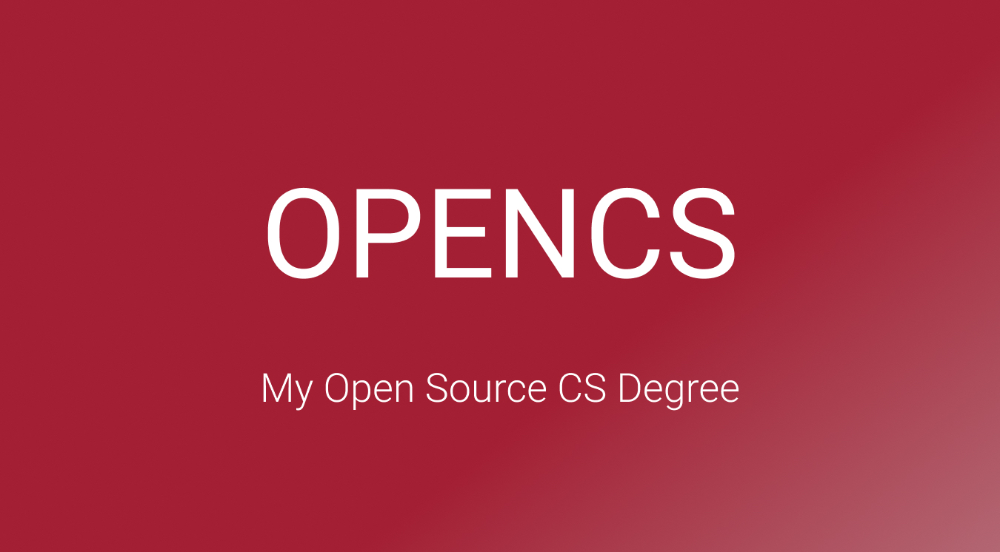

  

<h3 align="center">My Open Source CS Degree</h3>

  My Open Source education in computer science

# Content

- [Summary](#summary)
- [Program](#program)

# Summary

OPENCS is an open source computer science curriculum. This program is designed according to the degree requirements of undergraduate computer science majors from top universities. All courses included in this program, originate from the world's top educational institutions in the field of computer science, such as Harvard and University of Helsinki.

The curriculum is designed as follows:
- *Intro CS*: giving a basic but broad overview of the computer science spectrum.
- *Core CS*: classes that all computer science majors would require to take.
- *Specialization CS*: a specialization in software engineering.

Within the curriculum we chose to focus primarily on Java and Python as the used programming languages.

# Program

**Program version**: `1.4.0`

- [Basics CS](#basics-cs)
  - [Introduction to Computer Science](#introduction-to-computer-science)
  - [Introduction to Programming](#introduction-to-programming)
- [Core CS](#core-cs)
  - [Core Programming](#core-programming)
  - [Core Systems and Security](#core-systems-and-security)
  - [Core Theory](#core-theory)
  - [Databases and Core Applications](#databases-and-core-applications)
  - [Core Readings](#core-readings)
- [Specialization CS](#specialization-cs)
  - [Software Architecture Readings](#software-architecture-readings)
  - [App Development](#app-development)
---

## Basics CS

### Introduction to Computer Science

**Topics covered**:
`basic computer science`
`basic programming`
`basic data structures and algorithms`

Progress | Course(s) | University | Duration | Effort
:-- | :--: | :--: | :--: | :--:
 Finished ! | [CS50's Introduction to Computer Science](https://www.edx.org/course/cs50s-introduction-to-computer-science) | Harvard University | 12 weeks | 20 hours/week 

### Introduction to Programming

**Topics covered**:
`Java`
`object-oriented design`

Course(s) | Progress | University | Duration | Effort
:-- | :--: | :--: | :--: | :--:
 Finished ! | [Head First Java 2nd Edition O'Reilly](https://www.amazon.com/Head-First-Java-Kathy-Sierra/dp/0596009208) | Literature | 5 weeks | 10 hours/week 

## Core CS

### Core Programming
**Topics covered**:
`object-oriented design`
`Java`
`IDE`

Course(s) | Progress | University | Duration | Effort
:-- | :--: | :--: | :--: | :--:
 Finished ! | [Computing Tools for Computer Science Studies](https://courses.helsinki.fi/en/aytkt50003en/136459952) | University of Helsinki | 1 week | 8-10 hours/week
 Finished ! | [Java Programming I](https://java-programming.mooc.fi) | University of Helsinki | 7 weeks | 15-20 hours/week
 Finished ! | [Java Programming II](https://java-programming.mooc.fi) | University of Helsinki | 7 weeks | 15-20 hours/week

### Core Systems and Security

**Topics covered**:
`computer architecture`
`memory`
`assembly`
`operating systems`
`secure design`
`network security`

Course(s) | Progress | University | Duration | Effort
:-- | :--: | :--: | :--: | :--:
 Finished ! | [API and Web Service Introduction](https://www.udemy.com/course/api-and-web-service-introduction/) | Udemy | 1 week | 8 hours/week 
 Finished ! | [Introduction to Networking](https://www.youtube.com/playlist?list=PLEAYkSg4uSQ2dr0XO_Nwa5OcdEcaaELSG) | Stanford | 4 weeks | 7 hours/week 
 Finished ! | [Cyber Security Base: Introduction to Cyber Security](https://cybersecuritybase.mooc.fi/module-1) | University of Helsinki | 2 weeks | 8 hours/week
 Assigned | [Build a Modern Computer from First Principles: From Nand to Tetris](https://www.coursera.org/learn/build-a-computer) | Hebrew University of Jerusalem | 6 weeks | 7-13 hours/week 
 
### Core Theory

**Topics covered**:
`O-notation`
`data structures`
`algorithms`
`system design`
`design patterns`

Course(s) | Progress | University | Duration | Effort
:-- | :--: | :--: | :--: | :--:
 Finished ! | [Problem Solving with Algorithms and Data Structures Using Python](https://www.amazon.com/Problem-Solving-Algorithms-Structures-Python/dp/1590282574) | Literature | 10 weeks | 12 hours/week  
 Finished ! | [System Design Interview: An insider's guide](https://www.amazon.nl/System-Design-Interview-insiders-guide/dp/B08CMF2CQF/ref=sr_1_2?__mk_nl_NL=ÅMÅŽÕÑ&crid=RWPX24HYZU04&keywords=System+Design+Interview+–+An+insider%27s+guide&qid=1649541893&sprefix=system+design+interview+an+insider%27s+guide%2Caps%2C94&sr=8-2) | Literature | 4 weeks | 6 hours/week
 Finished ! | [Design Patterns Second Edition](https://www.amazon.com/Head-First-Design-Patterns-Object-Oriented/dp/149207800X) | Literature | 12 weeks | 6 hours/week
 
### Databases and Core Applications

**Topics covered**:
`databases`
`command line`
`Git`
`DevOps`
`containers`

Course(s) | Progress | University | Duration | Effort
:-- | :--: | :--: | :--: | :--:
 Finished ! | [The Git & Github Bootcamp](https://www.udemy.com/course/git-and-github-bootcamp/) | Udemy | 2 weeks | 10 hours/week
 Finished ! | [The Command Line Bootcamp](https://www.udemy.com/course/the-linux-command-line-bootcamp/) | Udemy | 2 weeks | 10 hours/week
 Finished ! | [Docker Mastery: Complete toolset](https://www.udemy.com/course/docker-mastery/) | Udemy | 2 weeks | 10 hours/week 
 Finished ! | [Apache Kafka Series: Kafka v2 for beginners](https://www.udemy.com/course/apache-kafka/) | Udemy | 2 weeks | 10 hours/week 
 Finished ! | [Databases: Relational Databases and SQL](https://www.edx.org/course/databases-5-sql) | Stanford | 2 weeks | 10 hours/week
 Finished ! | [Databases: Advanced Topics in SQL](https://www.edx.org/course/advanced-topics-in-sql) | Stanford | 2 weeks | 10 hours/week
 Finished ! | [Databases: Semistructured Data](https://www.edx.org/course/semistructured-data) | Stanford | 2 weeks | 10 hours/week
 Finished ! | [SQL and PostgreSQL: The Complete Developer's Guide](https://www.udemy.com/course/sql-and-postgresql/) | Udemy | 2 weeks | 20 hours/week

### Core Readings

**Topics covered**:
`software engineering`
`best practices`
`personal development`

Course(s) | Progress | University | Duration | Effort
:-- | :--: | :--: | :--: | :--:
 Finished ! | [The Pragmatic Programmer](https://www.amazon.com/Pragmatic-Programmer-Anniversary-Journey-Mastery/dp/B0833FBNHV/ref=sr_1_1?crid=3OE7U5XLXOSUA&dchild=1&keywords=pragmatic+programmer&qid=1601587989&s=books&sprefix=pragma%2Cstripbooks-intl-ship%2C230&sr=1-1) | Literature | 4 weeks | 6 hours/week  
 Finished ! | [Effective Java Third Edition](https://www.amazon.com/Effective-Java-Joshua-Bloch-ebook/dp/B078H61SCH/ref=sr_1_1?dchild=1&keywords=effective+java&qid=1601845225&s=digital-text&sr=1-1) | Literature | 4 weeks | 6 hours/week
 Assigned | [Clean Code](https://www.amazon.com/Clean-Code-Handbook-Software-Craftsmanship-ebook/dp/B001GSTOAM/ref=sr_1_1?crid=OCOVUA7BKEI0&dchild=1&keywords=clean+code&qid=1601845289&s=digital-text&sprefix=clean+%2Cdigital-text%2C308&sr=1-1) | Literature | 4 weeks | 6 hours/week
 Finished ! | [The Missing README](https://www.amazon.com/Missing-README-Guide-Software-Engineer/dp/1718501838?ref_=ast_slp_dp) | Literature | 3 months | 2 hours/week
 Finished ! | [OCA: Oracle Certified Associate Java SE 8 Programmer](https://www.amazon.nl/OCA-Certified-Associate-Programmer-1Z0-808/dp/1118957407/ref=asc_df_1118957407/?tag=nlshogostdde-21&linkCode=df0&hvadid=430605344342&hvpos=&hvnetw=g&hvrand=17230325203133114130&hvpone=&hvptwo=&hvqmt=&hvdev=c&hvdvcmdl=&hvlocint=&hvlocphy=9065300&hvtargid=pla-394932352707&psc=1) | Literature | 8 weeks | 20 hours/week
 
## Specialization CS

### Software Architecture Readings

**Topics covered**:
`software engineering`
`large-scale software architecture and design`
`distributed systems`
`testing`

Course(s) | Progress | University | Duration | Effort
:-- |:--:| :--: |:--------:| :--:
In progress | [Software Engineering at Google](https://www.amazon.com/Software-Engineering-Google-Lessons-Programming/dp/1492082791)  | Literature | 3 months | 4 hours/week
 Assigned | [Head First Software Architecture](https://www.amazon.com/Head-First-Software-Architecture-Architectural/dp/1098134354) | Literature | 6 weeks  | 10 hours/week
 Assigned | [Understanding Distributed Systems](https://www.amazon.com/Understanding-Distributed-Systems-distributed-applications/dp/1838430202) | Literature | 6 weeks  | 10 hours/week
 Assigned | [Designing Data-Intensive Applications](https://www.amazon.com/Designing-Data-Intensive-Applications-Reliable-Maintainable/dp/1449373321) | Literature | 8 weeks  | 10 hours/week

### App Development

**Topics covered**:
`Android development`
`Java`
`Gradle`

Course(s) | Progress | University | Duration | Effort
:-- | :--: | :--: | :--: | :--:
 Finished ! | [Nanodegree: Android Basics (deprecated)](https://www.udacity.com/course/android-basics-nanodegree-by-google--nd803) | Udacity | 12 weeks | 10 hours/week