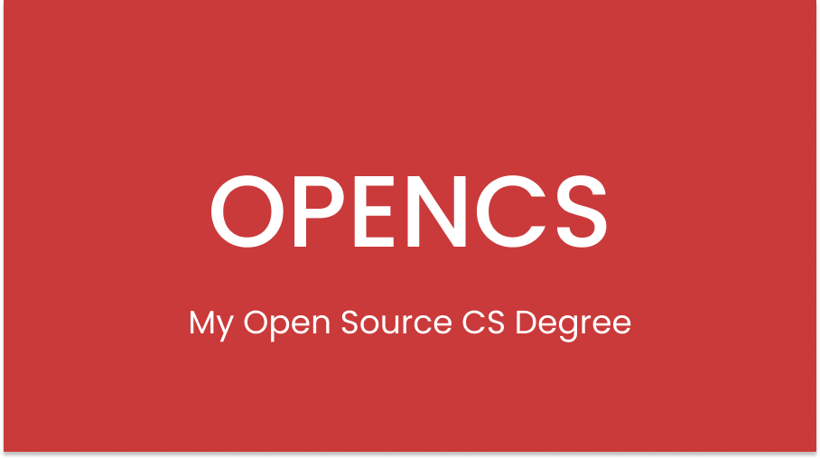

  

<h3 align="center">My Open Source CS Degree</h3>

  My Open Source education in computer science

# Content

- [Summary](#summary)
- [Program](#program)

# Summary

This program is designed according to the degree requirements of undergraduate computer science majors from top universities. All courses included in this program, originate from the world's top educational institutions in the field of computer science, such as Harvard, MIT, and University of Helsinki.

The curriculum is designed as follows:
- *Intro CS*: giving a basic but broad overview of the computer science spectrum.
- *Core CS*: classes that all computer science majors would be required to take.
- *Specialization CS*: a specialization in software engineering.

# Program

**Program version**: `1.0.2`

- [Basics CS](#basics-cs)
  - [Introduction to Computer Science](#introduction-to-computer-science)
  - [Introduction to Programming](#introduction-to-programming)
- [Core CS](#core-cs)
  - [Core Programming](#core-programming)
  - [Core Systems and Security](#core-systems-and-security)
  - [Core Theory](#core-theory)
  - [Core applications](#core-applications)
- [Specialization CS](#specialization-cs)
  - [Software Engineering](#software-engineering)
---

## Basics CS

### Introduction to Computer Science

**Topics covered**:
`basic computer science`
`basic programming`
`basic data structures and algorithms`

Progress | Course(s) | University | Duration | Effort
:-- | :--: | :--: | :--: | :--:
 Finished ! | [CS50's Introduction to Computer Science](https://www.edx.org/course/cs50s-introduction-to-computer-science) | Harvard University | 12 weeks | 20 hours/week 

### Introduction to Programming

**Topics covered**:
`Java`
`object-oriented design`

Course(s) | Progress | University | Duration | Effort
:-- | :--: | :--: | :--: | :--:
 Finished ! | [Head First Java 2nd Edition O'Reilly](https://www.amazon.com/Head-First-Java-Kathy-Sierra/dp/0596009208) | Literature | 5 weeks | 10 hours/week 

## Core CS

### Core Programming
**Topics covered**:
`object-oriented design`
`Java`
`command line`
`Git`
`IDE`
`static typing`

Course(s) | Progress | University | Duration | Effort
:-- | :--: | :--: | :--: | :--:
 Finished ! | [Computing Tools for Computer Science Studies](https://courses.helsinki.fi/en/aytkt50003en/136459952) | University of Helsinki | 1 week | 8-10 hours/week
 Finished ! | [Java Progamming I](https://java-programming.mooc.fi) | University of Helsinki | 7 week | 15-20 hours/week
 Finished ! | [Java Programming II](https://java-programming.mooc.fi) | University of Helsinki | 7 week | 15-20 hours/week

### Core Systems and Security

**Topics covered**:
`computer architecture`
`memory`
`assembly`
`operating systems`
`Secure Design`
`Network Security`

Course(s) | Progress | University | Duration | Effort
:-- | :--: | :--: | :--: | :--:
 In progress ! | [Introduction to Cyber Security](https://cybersecuritybase.mooc.fi/module-1) | University of Helsinki | 2 weeks | 8 hours/week 
 Assigned | [Securing Software](https://cybersecuritybase.mooc.fi/module-2.1) | University of Helsinki | 2 weeks | 8 hours/week
 Assigned | [Multithreading, Concurrency and Performance Optimization](https://www.udemy.com/course/java-multithreading-concurrency-performance-optimization/) | Udemy | 2 weeks | 4 hours/week 
 Assigned | [Build a Modern Computer from First Principles: From Nand to Tetris](https://www.coursera.org/learn/build-a-computer) | Hebrew University of Jerusalem | 6 weeks | 7-13 hours/week 
 Assigned | [Build a Modern Computer from First Principles: Nand to Tetris Part II ](https://www.coursera.org/learn/nand2tetris2) | Hebrew University of Jerusalem | 6 weeks | 12-18 hours/week 
 Assigned | [Introduction to Networking](https://www.youtube.com/playlist?list=PLEAYkSg4uSQ2dr0XO_Nwa5OcdEcaaELSG) | Stanford | 4 weeks | 7 hours/week 
 
### Core Theory

**Topics covered**:
`sorting and searching`
`O-notation`
`data structures`
`algorithms`
`interviewing`

Course(s) | Progress | University | Duration | Effort
:-- | :--: | :--: | :--: | :--:
In progress ! | [Problem Solving with Algorithms and Data Structures Using Python](https://www.amazon.com/Problem-Solving-Algorithms-Structures-Python/dp/1590282574) | Literature | 10 weeks | 12 hours/week  
Assigned | [Cracking the Coding Interview](https://www.amazon.com/Cracking-Coding-Interview-Programming-Questions/dp/0984782850/ref=sr_1_1?dchild=1&keywords=Cracking+the+coding+interview%5D&qid=1601415898&s=books&sr=1-1) | Literature | 12 weeks | 20 hours/week  
Assigned | [The Pragmatic Programmer](https://www.amazon.com/Pragmatic-Programmer-Anniversary-Journey-Mastery/dp/B0833FBNHV/ref=sr_1_1?crid=3OE7U5XLXOSUA&dchild=1&keywords=pragmatic+programmer&qid=1601587989&s=books&sprefix=pragma%2Cstripbooks-intl-ship%2C230&sr=1-1) | Literature | 4 weeks | 6 hours/week  
 
### Core Applications and Databases

**Topics covered**:
`databases`
`software engineering`
`Agile methodology`
`DevOps`
`refactoring`

Course(s) | Progress | University | Duration | Effort
:-- | :--: | :--: | :--: | :--:
 Assigned | [Relational Databases and SQL](https://www.edx.org/course/databases-5-sql) | Stanford | 2 weeks | 10 hours/week
 Assigned | [Databases: Modeling and Theory](https://www.edx.org/course/modeling-and-theory) | Stanford | 2 weeks | 10 hours/week
 Assigned | [Databases: Semistructured Data](https://www.edx.org/course/semistructured-data) | Stanford | 2 weeks | 10 hours/week
 Assigned | [Hands-on Scientific Computing](https://handsonscicomp.readthedocs.io/en/latest/) | University of Helsinki | 4 weeks | 10 hours/week
 Assigned | [DevOps with Docker](https://devopswithdocker.com) | University of Helsinki | 6 weeks | 10 hours/week

## Specialization CS

### Software Engineering

**Topics covered**:
`large-scale software architecture and design`
`compilers`
`debugging theory and practice`

Course(s) | Progress | University | Duration | Effort
:-- | :--: | :--: | :--: | :--:
 Assigned | [Software Engineering: Introduction](https://www.edx.org/course/software-engineering-introduction-ubcx-softeng1x) | The University of British Columbia | 6 weeks | 10 hours/week
 Assigned | [Software Debugging](https://www.udacity.com/course/software-debugging--cs259) | Udacity | 8 weeks | 6 hours/week
 Assigned | [Software Testing](https://www.udacity.com/course/software-testing--cs258) | Udacity | 4 weeks | 6 hours/week
 Assigned | [Software Architecture & Design](https://www.udacity.com/course/software-architecture-design--ud821) | Georgia Tech | 8 weeks | 12 hours/week