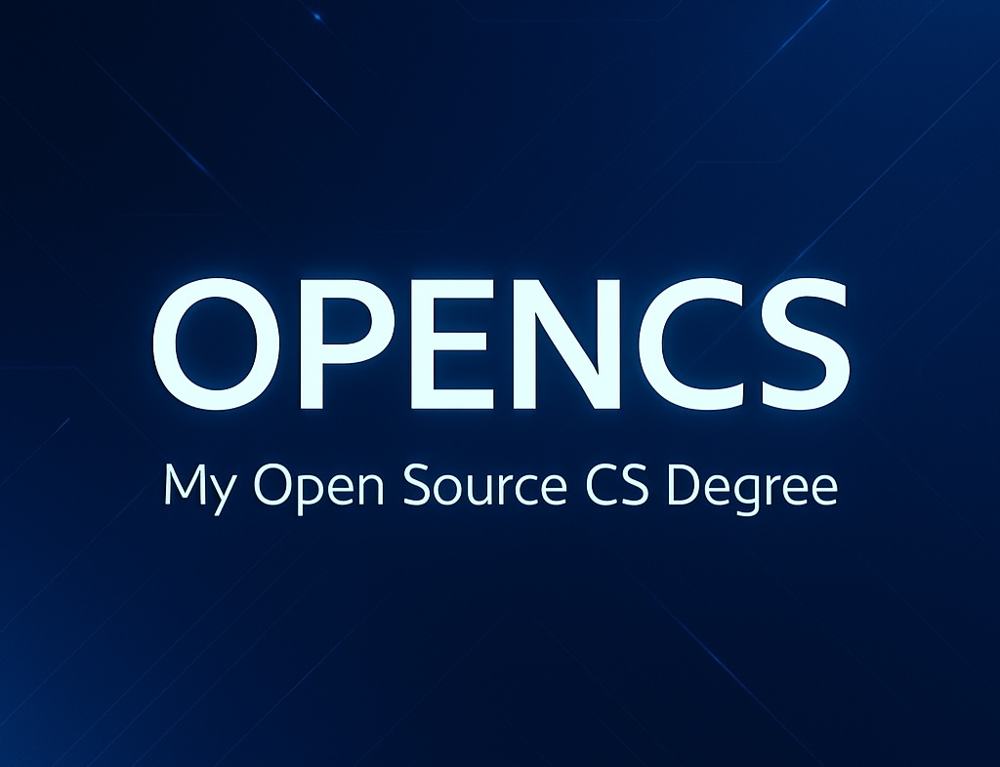

  

<h3 align="center">My Open Source CS Degree</h3>

  My Open Source education in computer science

# Content

- [Summary](#summary)
- [Program](#program)

# Summary

OPENCS is an open source computer science curriculum. This program is designed according to the degree requirements of undergraduate computer science majors from top universities. All courses included in this program, originate from the world's top educational institutions in the field of computer science, such as Harvard and University of Helsinki.

The curriculum is designed as follows:
- *Intro CS*: giving a basic but broad overview of the computer science spectrum.
- *Core CS*: classes that all computer science majors would require to take.
- *Specialization CS*: a specialization in software engineering.

# Program

**Program version**: `1.1.6`

- [Basics CS](#basics-cs)
  - [Introduction to Computer Science](#introduction-to-computer-science)
  - [Introduction to Programming](#introduction-to-programming)
- [Core CS](#core-cs)
  - [Core Programming](#core-programming)
  - [Core Systems and Security](#core-systems-and-security)
  - [Core Theory](#core-theory)
  - [Core Applications and Databases](#core-applications-and-databases)
  - [Core Additional Readings](#core-additional-readings)
- [Specialization CS](#specialization-cs)
  - [Software Engineering](#software-engineering)
  - [Web and App Development](#web-and-app-development)
---

## Basics CS

### Introduction to Computer Science

**Topics covered**:
`basic computer science`
`basic programming`
`basic data structures and algorithms`

Progress | Course(s) | University | Duration | Effort
:-- | :--: | :--: | :--: | :--:
 Finished ! | [CS50's Introduction to Computer Science](https://www.edx.org/course/cs50s-introduction-to-computer-science) | Harvard University | 12 weeks | 20 hours/week 

### Introduction to Programming

**Topics covered**:
`Java`
`object-oriented design`

Course(s) | Progress | University | Duration | Effort
:-- | :--: | :--: | :--: | :--:
 Finished ! | [Head First Java 2nd Edition O'Reilly](https://www.amazon.com/Head-First-Java-Kathy-Sierra/dp/0596009208) | Literature | 5 weeks | 10 hours/week 

## Core CS

### Core Programming
**Topics covered**:
`object-oriented design`
`Java`
`command line`
`Git`
`IDE`

Course(s) | Progress | University | Duration | Effort
:-- | :--: | :--: | :--: | :--:
 Finished ! | [Computing Tools for Computer Science Studies](https://courses.helsinki.fi/en/aytkt50003en/136459952) | University of Helsinki | 1 week | 8-10 hours/week
 Finished ! | [Java Progamming I](https://java-programming.mooc.fi) | University of Helsinki | 7 weeks | 15-20 hours/week
 Finished ! | [Java Programming II](https://java-programming.mooc.fi) | University of Helsinki | 7 weeks | 15-20 hours/week
 Finished ! | [Java Multithreading, Concurrency & Performance Optimization](https://www.udemy.com/course/java-multithreading-concurrency-performance-optimization/) | Udemy | 1 week | 8-10 hours/week

### Core Systems and Security

**Topics covered**:
`computer architecture`
`memory`
`assembly`
`operating systems`
`secure design`
`network security`

Course(s) | Progress | University | Duration | Effort
:-- | :--: | :--: | :--: | :--:
 Finished ! | [API and Web Service Introduction](https://www.udemy.com/course/api-and-web-service-introduction/) | Udemy | 1 week | 8 hours/week 
 Assigned | [Introduction to Networking](https://www.youtube.com/playlist?list=PLEAYkSg4uSQ2dr0XO_Nwa5OcdEcaaELSG) | Stanford | 4 weeks | 7 hours/week 
 Assigned | [Cyber Security Base: Introduction to Cyber Security](https://cybersecuritybase.mooc.fi/module-1) | University of Helsinki | 2 weeks | 8 hours/week 
 Assigned | [Cyber Security Base: Securing Software](https://cybersecuritybase.mooc.fi/module-2.1) | University of Helsinki | 2 weeks | 8 hours/week
 Assigned | [Build a Modern Computer from First Principles: From Nand to Tetris](https://www.coursera.org/learn/build-a-computer) | Hebrew University of Jerusalem | 6 weeks | 7-13 hours/week 
 
### Core Theory

**Topics covered**:
`sorting and searching`
`O-notation`
`data structures`
`algorithms`
`interviewing`

Course(s) | Progress | University | Duration | Effort
:-- | :--: | :--: | :--: | :--:
 Finished ! | [Problem Solving with Algorithms and Data Structures Using Python](https://www.amazon.com/Problem-Solving-Algorithms-Structures-Python/dp/1590282574) | Literature | 10 weeks | 12 hours/week  
 In progress | [OCA: Oracle Certified Associate Java SE 8 Programmer](https://www.amazon.nl/OCA-Certified-Associate-Programmer-1Z0-808/dp/1118957407/ref=asc_df_1118957407/?tag=nlshogostdde-21&linkCode=df0&hvadid=430605344342&hvpos=&hvnetw=g&hvrand=17230325203133114130&hvpone=&hvptwo=&hvqmt=&hvdev=c&hvdvcmdl=&hvlocint=&hvlocphy=9065300&hvtargid=pla-394932352707&psc=1) | Literature | 8 weeks | 20 hours/week
 Assigned | [Cracking the Coding Interview](https://www.amazon.com/Cracking-Coding-Interview-Programming-Questions/dp/0984782850/ref=sr_1_1?dchild=1&keywords=Cracking+the+coding+interview%5D&qid=1601415898&s=books&sr=1-1) | Literature | 12 weeks | 20 hours/week  

### Core Applications and Databases

**Topics covered**:
`databases`
`software engineering`
`agile methodology`
`DevOps`
`refactoring`

Course(s) | Progress | University | Duration | Effort
:-- | :--: | :--: | :--: | :--:
 In progress | [Hands-on Scientific Computing](https://handsonscicomp.readthedocs.io/en/latest/) | University of Helsinki | 4 weeks | 10 hours/week
 Assigned | [Version Control with Git](https://www.udacity.com/course/version-control-with-git--ud123) | Udacity | 4 weeks | 2.5 hours/week
 Finished ! | [Databases: Relational Databases and SQL](https://www.edx.org/course/databases-5-sql) | Stanford | 2 weeks | 10 hours/week
 Finished ! | [Databases: Advanced Topics in SQL](https://www.edx.org/course/advanced-topics-in-sql) | Stanford | 2 weeks | 10 hours/week
 Assigned | [Databases: Semistructured Data](https://www.edx.org/course/semistructured-data) | Stanford | 2 weeks | 10 hours/week
 Assigned | [DevOps with Docker](https://devopswithdocker.com) | University of Helsinki | 6 weeks | 10 hours/week

### Core Additional Readings

**Topics covered**:
`software engineering`
`design patterns`
`best practices`

Course(s) | Progress | University | Duration | Effort
:-- | :--: | :--: | :--: | :--:
 In progress | [The Pragmatic Programmer](https://www.amazon.com/Pragmatic-Programmer-Anniversary-Journey-Mastery/dp/B0833FBNHV/ref=sr_1_1?crid=3OE7U5XLXOSUA&dchild=1&keywords=pragmatic+programmer&qid=1601587989&s=books&sprefix=pragma%2Cstripbooks-intl-ship%2C230&sr=1-1) | Literature | 4 weeks | 6 hours/week  
 Assigned | [Clean Code](https://www.amazon.com/Clean-Code-Handbook-Software-Craftsmanship-ebook/dp/B001GSTOAM/ref=sr_1_1?crid=OCOVUA7BKEI0&dchild=1&keywords=clean+code&qid=1601845289&s=digital-text&sprefix=clean+%2Cdigital-text%2C308&sr=1-1) | Literature | 4 weeks | 6 hours/week  
 Finished ! | [Effective Java Third Edition](https://www.amazon.com/Effective-Java-Joshua-Bloch-ebook/dp/B078H61SCH/ref=sr_1_1?dchild=1&keywords=effective+java&qid=1601845225&s=digital-text&sr=1-1) | Literature | 4 weeks | 6 hours/week  
 Assigned | [Design Patterns Second Edition](https://www.amazon.com/Head-First-Design-Patterns-Object-Oriented/dp/149207800X) | Literature | 4 weeks | 6 hours/week  
 
## Specialization CS

### Software Engineering

**Topics covered**:
`large-scale software architecture and design`
`compilers`
`debugging theory and practice`

Course(s) | Progress | University | Duration | Effort
:-- | :--: | :--: | :--: | :--:
 Assigned | [Software Engineering: Introduction](https://www.edx.org/course/software-engineering-introduction-ubcx-softeng1x) | The University of British Columbia | 6 weeks | 10 hours/week
 Assigned | [Software Construction in Java](https://openlearninglibrary.mit.edu/courses/course-v1:MITx+6.005.1x+3T2016/about) | MIT | 10 weeks | 10 hours/week
 Assigned | [Advanced Software Construction in Java](https://openlearninglibrary.mit.edu/courses/course-v1:MITx+6.005.2x+1T2017/about) | MIT | 10 weeks | 10 hours/week
 Assigned | [Software Debugging](https://www.udacity.com/course/software-debugging--cs259) | Udacity | 8 weeks | 6 hours/week
 Assigned | [Software Testing](https://www.udacity.com/course/software-testing--cs258) | Udacity | 4 weeks | 6 hours/week
 Assigned | [Software Architecture & Design](https://www.udacity.com/course/software-architecture-design--ud821) | Georgia Tech | 8 weeks | 12 hours/week

### Web and App Development

**Topics covered**:
`Android development`
`Java`
`Gradle`
`Fullstack web development`
`JavaScript`
`React`

Course(s) | Progress | University | Duration | Effort
:-- | :--: | :--: | :--: | :--:
 Finished ! | [Android Basics Nanodegree by Google (Java)](https://www.udacity.com/course/android-basics-nanodegree-by-google--nd803) | Udacity | 3 months | 10 hours/week
 Assigned | [Full stack open 2021 Bootcamp](https://fullstackopen.com/en/) | University of Helsinki | 3 months | 10 hours/week